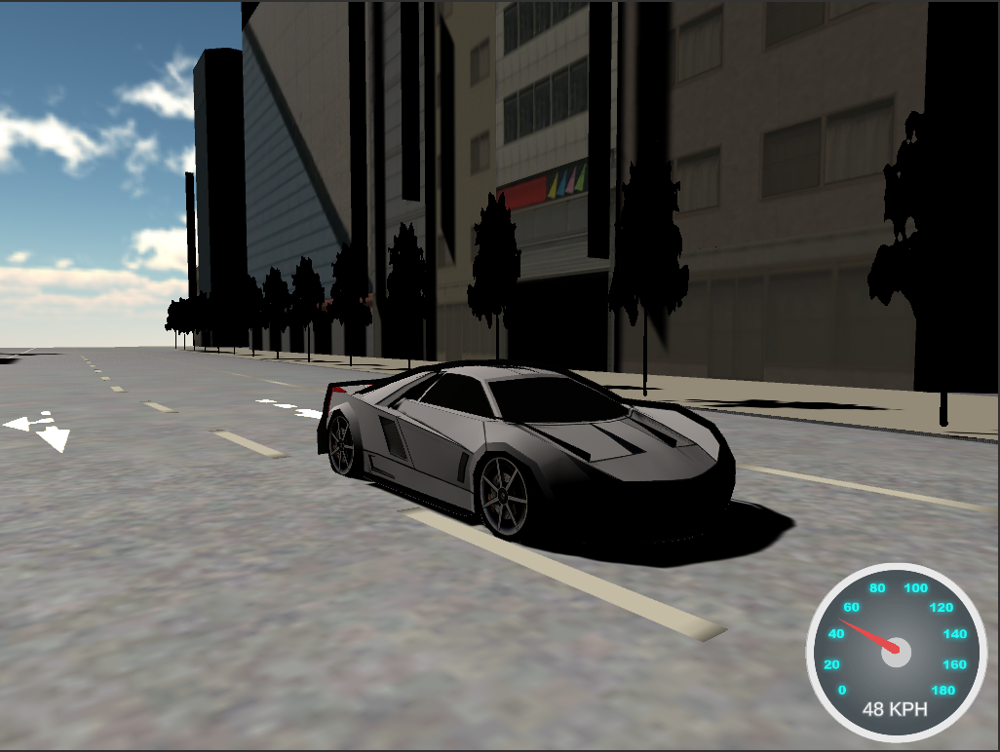

# Just Drive
You cannot slow down and you cannot stop! Drive around the city in this 3D Unity game.

### Preview



## Main features

- Single player (3rd Person)
- Open world city map
- Increasing difficulty as time goes on
- Car heads up display
- Sound effects
- Custom main menu splash screen
- Pausing

## Requirements
```
Unity Version: 2019.1.12f1
```

## Installation
Here is how you can install this project:

```
$ git clone git@github.com:joshua-booth/just-drive.git
```

## Usage
Open the project in Unity Hub with the correct unity version.

### Building
To build the project navigate from the following:

```
File > Build and Run
```

or

```
File > Build Settings...
```

### Running
Locate your built project directory then click on the executable file or run the following command:

```
start "Just Drive.exe"
```
or
```
$ ./"Just Drive.exe"
```


## Author

* [Joshua Booth](https://github.com/Joshua-Booth)